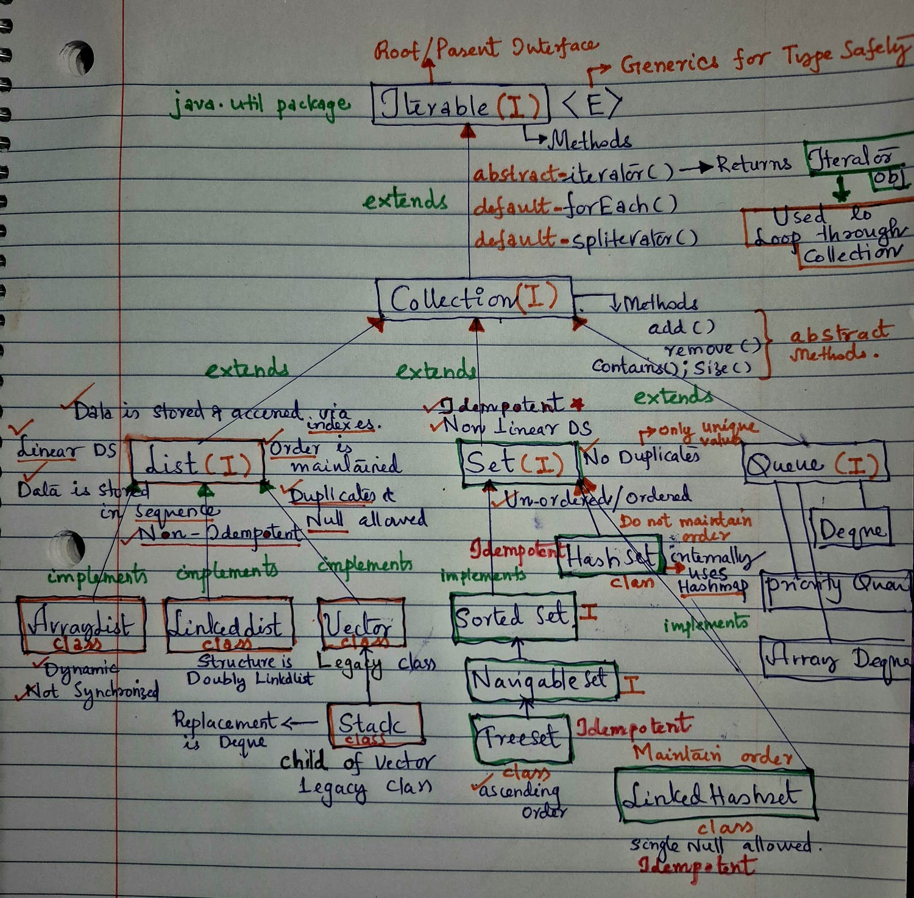

## Java Collection Hierarchy




## Summary: Java Collection Hierarchy
```
Iterable is the top-most interface in the Collection hierarchy.

It defines the iterator() method and is implemented by all collection classes.

Enables use of the enhanced for-each loop (for-each) in Java.

Collection extends Iterable and is the root interface for most data structures (excluding Map).

Collection has 3 main subinterfaces:

         > List – Ordered, allows duplicates (e.g., ArrayList, LinkedList)

         > Set – Unordered, no duplicates (e.g., HashSet, TreeSet)

         > Queue – Typically FIFO (e.g., PriorityQueue, Deque)

Map is not a child of Collection; it's a separate interface that stores key-value pairs.

Common classes: HashMap, TreeMap, LinkedHashMap


Legacy Classes:

Vector, Stack, and Hashtable were introduced before Java 1.2

Synchronized but less preferred in modern development


Modern Alternatives:

Use ArrayList instead of Vector

Use Deque instead of Stack

Use ConcurrentHashMap instead of Hashtable for multithreaded use.

```